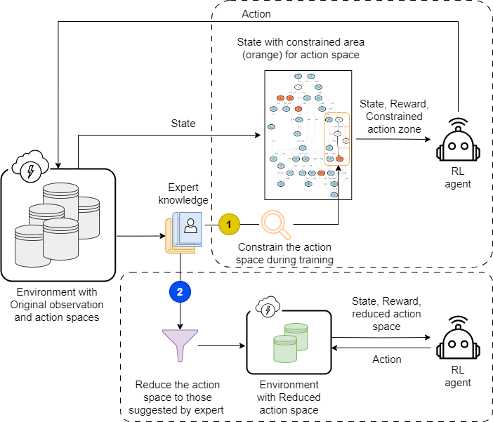
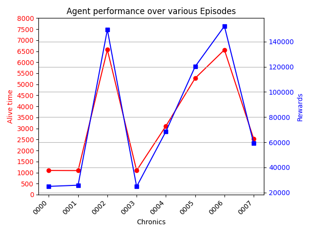
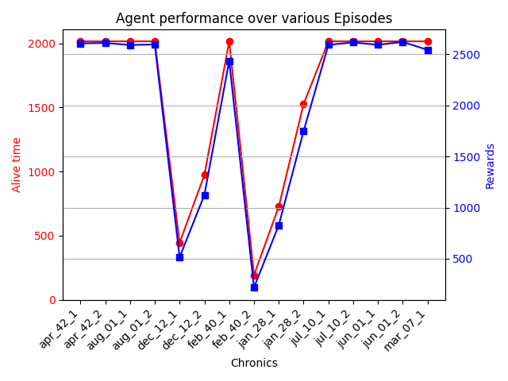

# T2.1_deep_expert
Expert Agent python package exploiting the expert knowledge in two ways:
1. Focus the exploration phase of an RL agent (DeepQ) on specific zones of a power grid
2. Reduce the action space to most relevant ones and improve the scalability or RL agents. There are two variants of this approach:
    - *Heuristic-based*: A set of well known heuristics with some greedy search over the reduced action space is used to solve the overload and congestion problems;
    - *Learning-based*: A PPO tries to learn the effective topological manipulations on the grid, by considering the reduced action space. Its combination with some heuristics helps to remedy most of the overload and congestion problems. 



# Credits
- Credits for Javaness [winning solution](https://github.com/lajavaness/l2rpn-2023-ljn-agent) at the L2RPN 2023 IDF AI challenge which has inspired the heuristic part of this work and most of the code is adapted and reused. The adapted code is on a forked repository which could be found [here](https://github.com/Mleyliabadi/l2rpn-2023-ljn-agent). 
- Credits for [CurriculumAgent](https://github.com/FraunhoferIEE/curriculumagent), which has inspired the search for reduced action space. Herein, we have replaced the greedy search over all the action space, by those suggested using expert knowlege. 
- The action suggested by expert knowledge uses the [ExpertOp4Grid](https://github.com/marota/ExpertOp4Grid) package.

# Installation guide
To be able to run the experiments in this repository, the following steps show how to install this package and its dependencies from source.

### Requirements
- Python >= 3.6
- [ExpertOp4Grid package (customized)](https://github.com/Mleyliabadi/ExpertOp4Grid)
- [LJN agent package (customized)](https://github.com/Mleyliabadi/l2rpn-2023-ljn-agent)

### Setup a Virtualenv (optional)
#### Create a Conda env (recommended)
```bash
conda create -n expert_agent python=3.10
conda activate venv_gnn
```
#### Create a virtual environment

```bash
cd my-project-folder
pip3 install -U virtualenv
python3 -m virtualenv venv_expert_agent
source venv_expert_agent/bin/activate
```

### Install the prerequisites

#### ExpertOp4Grid package
```bash
git clone git@github.com:Mleyliabadi/ExpertOp4Grid.git
cd ExpertOp4Grid
pip install -U .
```

#### LJN Agent package
```
git clone git@github.com:Mleyliabadi/l2rpn-2023-ljn-agent.git
cd l2rpn-2023-ljn-agent
pip install -U .
```

### Install the current package from source
```bash
git clone git@github.com:AI4REALNET/T2.1_deep_expert.git
cd T2.1_deep_expert
pip3 install -U .[recommended]
```

### To contribute
```bash
pip3 install -e .[recommended]
```


## Overview of code structure
:open_file_folder: **ExpertAgent**

├── :open_file_folder: configs

│   └── ...

├── :open_file_folder: getting_started

│   &ensp;&ensp;&ensp;&ensp;└── 0_extract_actions.ipynb

│   &ensp;&ensp;&ensp;&ensp;└── 1_apply_deepqexpert.ipynb

│   &ensp;&ensp;&ensp;&ensp;└── 2_apply_expert_agent_heuristic.ipynb

│   &ensp;&ensp;&ensp;&ensp;└── 3_apply_expert_agent_rl.ipynb

├── :open_file_folder: ExpertAgent

│   └── :open_file_folder: assets

│     &ensp;&ensp;&ensp;&ensp;└── ...

│   └── :open_file_folder: DeepQExpert

│     &ensp;&ensp;&ensp;&ensp;└── ...

│   └── :open_file_folder: ExpertAgent

│     &ensp;&ensp;&ensp;&ensp;└── agentHeuristic.py

│     &ensp;&ensp;&ensp;&ensp;└── agentRL.py

│   └── :open_file_folder: utils

│     &ensp;&ensp;&ensp;&ensp;└── extractExpertActions.py

│     &ensp;&ensp;&ensp;&ensp;└── extractAttackingExpertActions.py

│     &ensp;&ensp;&ensp;&ensp;└── ...

├── setup.py


## Reproducibility
### 1. DeepQExpert Agent
----
This agent applies an extended DeepQ algorithm for power grids and specifically works good with ``l2rpn_case14_sandbox`` environment.

#### Train
To train this agent, the following command could be executed from root and CLI:
```bash
python ExpertAgent/DeepQExpert/train.py \ 
    --save_path="l2rpn_case14_sandbox" \
    --num_train_steps=1000000 \
    --name="DeepQExpert" \
    --logs_dir="l2rpn_case14_sandbox/logs"
```
At the end of the training, the weights of the model and some information concerning the neural network architecture are saved and logged.

#### Evaluate
To evaluate an already trained version of it, the following command could be executed from root and using CLI:
```bash
python ExpertAgent/DeepQExpert/evaluate.py
```

At the end of the evaluation, a graphic representing the performance (reward/alive time) of the agent is visualized to the user.



### 2. ExpertAgent Heuristics
--------------------------
The heuristic version of the `ExpertAgent` does not require any training and the evaluation could be run using a main function included in the root of the package. This agent is already provided to work for `ai4realnet_small` scenario of AI4REALNET project and power grid usecase (first).

```bash
python main_expert_heuristic.py --nb_episode=15 --nb_process=1 --max_step=2016 --verbose=True 
```

At the end of the evaluation a graphic representing the performance (reward/alive time) of the agent is visualized to the user.



### 3. ExpertAgent RL
------------------
